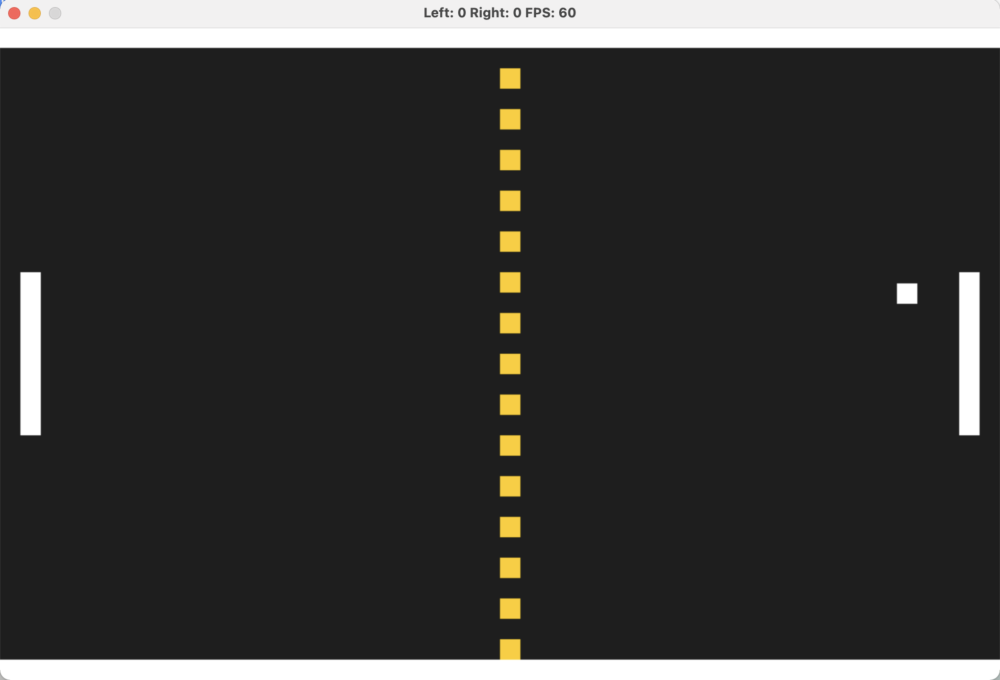

# CPPND: Capstone Classic Arcade Game Deck

This repo builds on top of the Capstone project [starter code repo](https://github.com/udacity/CppND-Capstone-Snake-Game) in the [Udacity C++ Nanodegree Program](https://www.udacity.com/course/c-plus-plus-nanodegree--nd213). The code for this repo was inspired by [this](https://codereview.stackexchange.com/questions/212296/snake-game-in-c-with-sdl) excellent StackOverflow post and set of responses.

## Dependencies for Running Locally
* cmake >= 3.7
  * All OSes: [click here for installation instructions](https://cmake.org/install/)
* make >= 4.1 (Linux, Mac), 3.81 (Windows)
  * Linux: make is installed by default on most Linux distros
  * Mac: [install Xcode command line tools to get make](https://developer.apple.com/xcode/features/)
  * Windows: [Click here for installation instructions](http://gnuwin32.sourceforge.net/packages/make.htm)
* SDL2 >= 2.0
  * All installation instructions can be found [here](https://wiki.libsdl.org/Installation)
  >Note that for Linux, an `apt` or `apt-get` installation is preferred to building from source. 
* gcc/g++ >= 5.4
  * Linux: gcc / g++ is installed by default on most Linux distros
  * Mac: same deal as make - [install Xcode command line tools](https://developer.apple.com/xcode/features/)
  * Windows: recommend using [MinGW](http://www.mingw.org/)

## Basic Build Instructions (Common for all Games)

1. Clone this repo.
2. Make a build directory in the top level directory: `mkdir build && cd build`
3. Compile: `cmake .. && make`
4. Run it: `./SnakeGame`.

## 2 Player Pong

Your classic 2 player pong game! 
### How to Play
1. Use the 'W' and 'S' keys to move the left paddle up and down.
2. Use the Up and Down arrow keys to move the right paddle up and down.

To run: `./PongGame` after following the Basic Build Instructions.

### Capstone Rubric Satisfaction:
1. The project accepts user input and processes the input: In [controller.cpp](./src/pong/controller.cpp), user key presses and releases are captured and processed in [paddle.cpp](./src/pong/paddle.cpp) to control the movement of each of the pong paddles.
2. The project uses Object Oriented Programming techniques. All core functionality of the game is captures within classes. Inheritence is also used to centralize a common rendering function ([pongObject.cpp](./src/pong/pongObject.cpp))
3. Classes use appropriate access specifiers for class members. All class data members have explicit access specifiers.
4. Class constructors utilize member initialization lists. Initialization lists are used throughout. Some examples are in [ball.cpp](./src/pong/ball.cpp) and [paddle.cpp](./src/pong/paddle.cpp)
5. The project makes use of references in function declarations. References are utilitized throughout the code. Some examples are in [controller.h](./src/pong/controller.h) and [renderer.h](./src/pong/renderer.h)

## Snake Game

To run: `./SnakeGame` after following the Basic Build Instructions.

## CC Attribution-ShareAlike 4.0 International

Shield: [![CC BY-SA 4.0][cc-by-sa-shield]][cc-by-sa]

This work is licensed under a
[Creative Commons Attribution-ShareAlike 4.0 International License][cc-by-sa].

[![CC BY-SA 4.0][cc-by-sa-image]][cc-by-sa]

[cc-by-sa]: http://creativecommons.org/licenses/by-sa/4.0/
[cc-by-sa-image]: https://licensebuttons.net/l/by-sa/4.0/88x31.png
[cc-by-sa-shield]: https://img.shields.io/badge/License-CC%20BY--SA%204.0-lightgrey.svg
